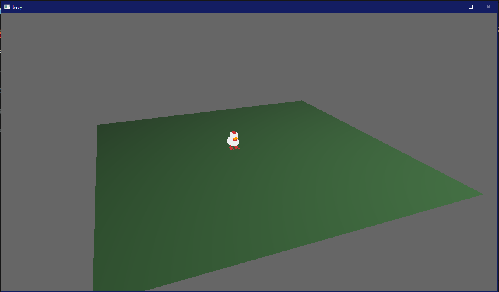

<h1>
<code>bevy_vox_mesh</code>
</h1>

<a href="https://crates.io/crates/bevy_vox_mesh">

</a>

A plugin for the bevy engine which allows loading magica voxel `.vox` files directly into usable meshes. 


## Bevy compatibility

| Bevy version | Plugin version |
|--------------|----------------|
| 0.5          | 0.1            |
|              |                |


## Usage




```rust

use bevy::{
    prelude::*,
    render::{
        pipeline::{PipelineDescriptor, RenderPipeline},
        shader::{ShaderStage, ShaderStages},
    },
};
use bevy_vox_mesh::VoxMeshPlugin;

fn main() {
    App::build()
        .add_plugins(DefaultPlugins)
        .add_plugin(VoxMeshPlugin)
        .add_startup_system(setup.system())
        .run();
}

fn setup(mut meshes: ResMut<Assets<Mesh>>,
         mut commands: Commands,
         assets: ResMut<AssetServer>
) {

    // After having created and registered a render pipeline which supports vertex coloring.

    //spawn a mesh bundle to render our loaded voxel mesh
    commands.spawn_bundle(MeshBundle {
        mesh: assets.load("my_voxel_model.vox"),
        render_pipelines: RenderPipelines::from_pipelines(vec![RenderPipeline::new(HANDLE_TO_PIPELINE_WITH_VERTEX_COLORING)]),
        transform: Transform::from_scale((0.01, 0.01, 0.01).into())
            * Transform::from_rotation(Quat::from_axis_angle(Vec3::Y, PI)),
        ..Default::default()
    });

    commands.spawn_bundle(PerspectiveCameraBundle {
        transform: Transform::from_xyz(-2.0, 2.5, 5.0).looking_at(Vec3::ZERO, Vec3::Y),
        ..Default::default()
    });
}


```

Take a look in the `examples/` directory for a complete working example.