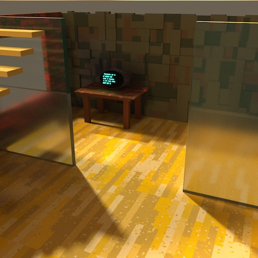
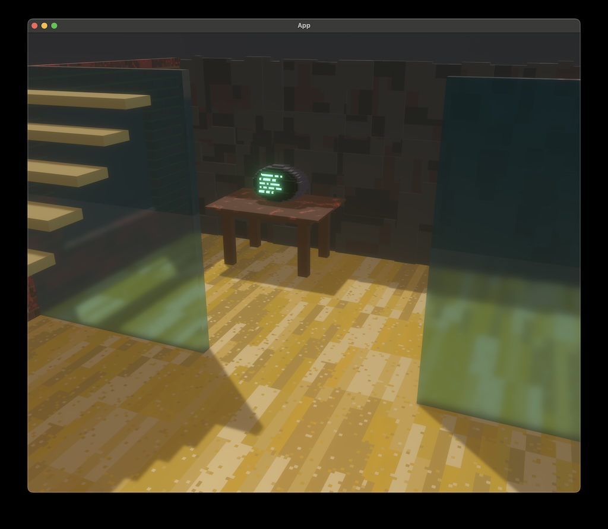

<h1>
<code>bevy_vox_scene</code>
</h1>


<a href="https://crates.io/crates/bevy_vox_scene">

</a>

A plugin for [the Bevy Engine](https://bevyengine.org) which allows loading [Magica Voxel](https://ephtracy.github.io) `.vox` files directly into a Bevy scene graph.
`bevy_vox_scene` is forked from the excellent [`bevy_vox_mesh` crate](https://crates.io/crates/bevy_vox_mesh).

## Why `bevy-vox-scene`?

Whereas other voxel crates load a single model with voxel colors but no other material properties, `bevy_vox_scene` can load an entire scene graph from a Magica Voxel world file, and it attempts to recreate the material properties from Magica Voxel's render tab. This means you can produce a scene in Bevy that approximates Magica Voxel's raytraced renders, but at Bevy's real-time interactive framerates.

Here is the [study example scene](examples/transmission-scene.rs) as rendered by Magica Voxel's raytracer:


And this is the same scene in Bevy:


All Magica Voxel material types except "cloud" are supported. Bevy's screen space transmission does a great job of rendering glass materials. 

`bevy_vox_scene` achieves this by generating a series of texture atlases for the scene to capture the differing color, metalness, roughness, emission, and transparency for each Voxel type in the scene.

## Usage

1. Add the crate using cargo: `cargo add bevy_vox_scene`
2. Import the library: 
```rust
use bevy_vox_scene::{VoxScenePlugin, VoxelSceneBundle};
```

3. Add the plugin to the app: 
```rust
app.add_plugins(VoxScenePlugin)
```

4. Spawn an entire scene graph using `VoxelSceneBundle`:
```rust
commands.spawn(VoxelSceneBundle {
    scene: assets.load("study.vox"),
    ..default()
});
```
Alternatively, spawn any node of the scene graph, down to individual models, using the name you assigned to the node in MagicaVoxel:

```rust
commands.spawn(VoxelSceneBundle {
    scene: assets.load("study.vox#desk"),
    ..default()
});
```

Take a look in the `examples/` directory for complete working examples. To run an example, enter:
```
cargo run --example <example name>
```

- If you want glowing emissive voxels, add an HDR and bloom-enabled camera. See the [`emissive-model` example](/examples/emissive-model.rs).
- Enabling Screen-Space Ambient Occlusion can give your voxel scenes more pop. See the [`ssao-model` example](/examples/ssao-model.rs).
- If you want glass voxels to refract other objects in the scene, enable specular transmission on your camera3d. See the [`transmission-scene` example](/examples/transmission-scene.rs).

## Bevy and Magica Voxel compatibility

| Bevy version | Magica Voxel version | `bevy-vox-scene` version | 
| ------------ | -------------- | --- |
| 0.12         | 0.99.6               | 0.9, 0.10       | 

## Limitations and workarounds

- When spawning individual named meshes as subassets (`assets.load("study.vox#desk")`), you'll need to ensure that the name you have given it in Magica Voxel is unique within the file. Avoid names that begin with the word `material` or `model` as these are reserved for the various subassets that make up the scene.
- In MagicaVoxel's raytraced renders, emissive materials contribute to the lighting of a scene. Emissive materials do not currently do this in Bevy, they just glow. If in future Bevy implements a global illumination system, then emissive materials would contribute to the lighting.
- MagicaVoxel "cloud" materials are not currently supported.
- Material properties (color, roughness, metalness, emission, transparency) are achieved using 16x16 pixel texture atlases that are indexed from the meshes UVs. Therefore it isn't possible to do "Minecraft" style texturing (where a texture is tiled over each voxel). For that effect, consider using [the `bevy_vox_mesh` crate](https://crates.io/crates/bevy_vox_mesh) instead.

### Transparent materials

TLDR: split up models containing glass voxels into convex chunks using Magica Voxel's world editor.

> Magica Voxel tip: you might need to manually move the transmissive models to last in Magica Voxel's render order for other models in the scene to be visible through them. Tap "Order -> Last" on the model that has the glass voxels. Although the scene hierarchy will be imported into Bevy with `VoxelSceneBundle`, the ordering of sibling nodes in Magica Voxel files has no effect on bevy rendering.

- If you have a concave model that contains glass voxels, the other parts of that model will not be visible through the glass voxels. This is a limitation of Bevy's screen-space specular transmission system. To work around this limitation, use the Magica Voxel world editor to break up models that contain glass elements into separate models that are each convex.
- Bevy's StandardMaterial only allows a single Index of Refraction (IoR) per material. The IoR contained in a model are averaged together to arrive at this value. If your scene contains transmissive materials that have widely differing IoRs (eg water vs diamond), and you think that averaging those IoRs together makes a significant visible difference to the scene, consider breaking the model up into separate meshes for each transmissive medium.
- Bevy's Screen Space Ambient Occlusion (SSAO) appears to block the blurring affect that you get from glass materials that have roughness. If you have rough glass materials, consider not using SSAO.

## Developing `bevy_vox_scene`

After cloning this repo, use Cargo run the unit tests:

```
cargo test --lib
```

## Acknowledgements

Forked from the excellent [`bevy_vox_mesh` crate](https://crates.io/crates/bevy_vox_mesh) by Lucas A.

Like `bevy-vox-mesh`, `bevy-vox-scene` uses `dot-vox` to parse the vox files and the greedy mesher from [`block-mesh-rs`] (https://github.com/bonsairobo/block-mesh-rs) to create efficient meshes.
