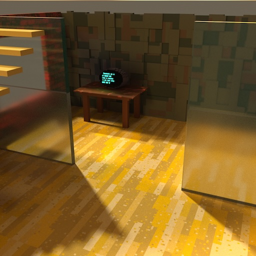
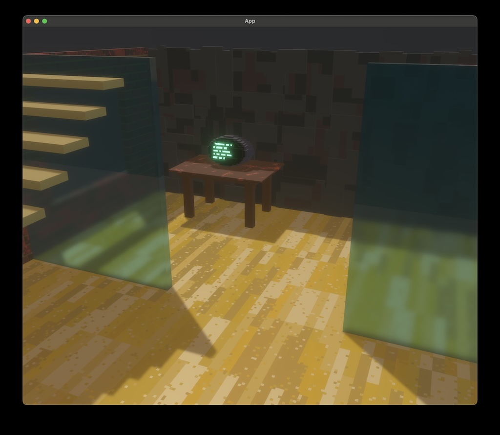

<h1>
<code>bevy_vox_scene</code>
</h1>

[](https://crates.io/crates/bevy_vox_scene)
[](https://docs.rs/bevy_vox_scene)
[](https://github.com/Utsira/bevy_vox_scene/actions/workflows/ci.yml)
[](https://deps.rs/crate/bevy_vox_scene/0.20.0)
[](https://bevyengine.org/learn/book/plugin-development/#main-branch-tracking)
[](https://codecov.io/gh/Utsira/bevy_vox_scene)

A plugin for [the Bevy Engine](https://bevyengine.org) which focuses on bringing all the features of [Magica Voxel](https://ephtracy.github.io) `.vox` files into bevy, including:
- __Voxel models__, with support for almost all Magica Voxel's material types and properties, such as metalness, roughness, emission, transmission, and cloud.
- __Voxel animations__
- __Voxel scenes__, allowing efficient instancing of voxel models, organisation of models into layers, controlling visibility of layers and instances. Use Magica Voxel as your level editor!

## Why `bevy-vox-scene`?

Whereas other voxel crates focus on massive voxel worlds and efficient spatial partitioning, or on loading a single model with voxel colors but no other material properties, `bevy_vox_scene` can load an entire scene graph from a Magica Voxel world file, or a voxel animation, and it attempts to recreate the material properties from Magica Voxel's render tab. This means you can produce a scene in Bevy that approximates Magica Voxel's raytraced renders, but at Bevy's real-time interactive framerates.

Here is the [study example scene](examples/transmission-scene.rs) as rendered by Magica Voxel's raytracer:


And this is the same scene in Bevy:


Almost all Magica Voxel material types are supported. Bevy's screen space transmission does a great job of rendering glass materials, while Magica Voxel cloud materials are imported into Bevy as volumetric fog.

`bevy_vox_scene` achieves this by generating a series of texture atlases for the scene to capture the differing color, metalness, roughness, emission, and transparency for each Voxel type in the scene, and a volumetric texture for models containing cloud materials.

## Usage

1. Add the crate using the command line (`cargo add bevy_vox_scene`) or by adding it to `Cargo.toml`:

```toml
[dependencies]
bevy_vox_scene = "0.20.0"
```

   Then in code:

```rust no_run
use bevy::prelude::*;
use bevy_vox_scene::VoxScenePlugin; // 2.

fn main() {
    App::new()
        .add_plugins((
            DefaultPlugins, 
            VoxScenePlugin::default()
        )) // 3.
        .add_systems(Startup, setup)
        .run();
}

fn setup(mut commands: Commands, assets: Res<AssetServer>) {
    commands.spawn(SceneRoot(assets.load("study.vox#workstation/desk"))); //4
}
```

2. Import the library.
3. Add the plugin to the app.
4. Spawn a scene graph using `SceneRoot`. Alternatively, spawn any node of the scene graph, down to individual models, using the name you assigned to the node in MagicaVoxel.

Take a look in the `examples/` directory for complete working examples. To run an example, type the following into the terminal:
```ignore
cargo run --example <example name>
```

- To modify entities within a scene hierarchy using bevy observers, see the [`modify-scene` example](/examples/modify-scene.rs).
- If you want glowing emissive voxels, add an HDR and bloom-enabled camera. See the [`emissive-model` example](/examples/emissive-model.rs).
- Enabling Screen-Space Ambient Occlusion can give your voxel scenes more pop. See the [`ssao-model` example](/examples/ssao-model.rs).
- If you want glass voxels to refract other objects in the scene, enable specular transmission on your camera3d. See the [`transmission-scene` example](/examples/transmission-scene.rs).
- If you want to render cloud voxels as volumetric fog, add `VolumetricFog` to your camera, and `VolumetricLight` to your lights. `bevy-vox-scene` will convert cloud voxels into density textures and insert them into your scene as `FogVolume`s. See the [`cloud-scene` example](/examples/cloud-scene.rs).

## Bevy and Magica Voxel compatibility

| Bevy version | Magica Voxel version           | `bevy-vox-scene` version | 
| ------------ | ------------------------------ | ------------------------ |
| 0.12         | 0.99.6, 0.99.7                 | 0.9, 0.10, 0.11, 0.12    | 
| 0.13         |                                | 0.13                     |
| 0.14         |                                | 0.14, 0.15               |
| 0.15         |                                | 0.16                     |
|              | - support cloud materials      | 0.17                     |
|              | - support animation            | 0.18                     |
| 0.16         |                                | 0.19                     |
| 0.17         |                                | 0.20                     |

## Limitations and workarounds

- When spawning individual named meshes as subassets (`assets.load("study.vox#desk")`), you'll need to ensure that the name you have given it in Magica Voxel is unique within the file. Avoid names that begin with the word `material` or `model` as these are reserved for the various subassets that make up the scene.
- In MagicaVoxel's raytraced renders, emissive materials contribute to the lighting of a scene. Emissive materials do not currently do this in Bevy, they just glow. If in future Bevy implements a global illumination system, then emissive materials would contribute to the lighting.
- Material properties (color, roughness, metalness, emission, transparency) are achieved using 16x16 pixel texture atlases that are indexed from the meshes UVs. Therefore it isn't possible to do "Minecraft" style texturing (where a texture is tiled over each voxel). For that effect, consider using [the `bevy_vox_mesh` crate](https://crates.io/crates/bevy_vox_mesh) instead.

### Transparent materials

TLDR: split up models containing glass voxels into convex chunks using Magica Voxel's world editor.

> Magica Voxel tip: you might need to manually move the transmissive models to last in Magica Voxel's render order for other models in the scene to be visible through them. Tap "Order -> Last" on the model that has the glass voxels. Although the scene hierarchy will be imported into Bevy with `VoxelSceneBundle`, the ordering of sibling nodes in Magica Voxel files has no effect on bevy rendering.

- If you have a concave model that contains glass voxels, the other parts of that model will not be visible through the glass voxels. This is a limitation of Bevy's screen-space specular transmission system. To work around this limitation, use the Magica Voxel world editor to break up models that contain glass elements into separate models that are each convex.
- Bevy's StandardMaterial only allows a single Index of Refraction (IoR) per material. The IoR contained in a model are averaged together to arrive at this value. If your scene contains transmissive materials that have widely differing IoRs (eg water vs diamond), and you think that averaging those IoRs together makes a significant visible difference to the scene, consider breaking the model up into separate meshes for each transmissive medium.

## Acknowledgements

Forked from the excellent [`bevy_vox_mesh` crate](https://crates.io/crates/bevy_vox_mesh) by Lucas A.

Like `bevy-vox-mesh`, `bevy-vox-scene` uses [`dot-vox`](https://github.com/dust-engine/dot_vox) to parse the vox files and the greedy mesher from [`block-mesh-rs`] (https://github.com/bonsairobo/block-mesh-rs) to create efficient meshes.
